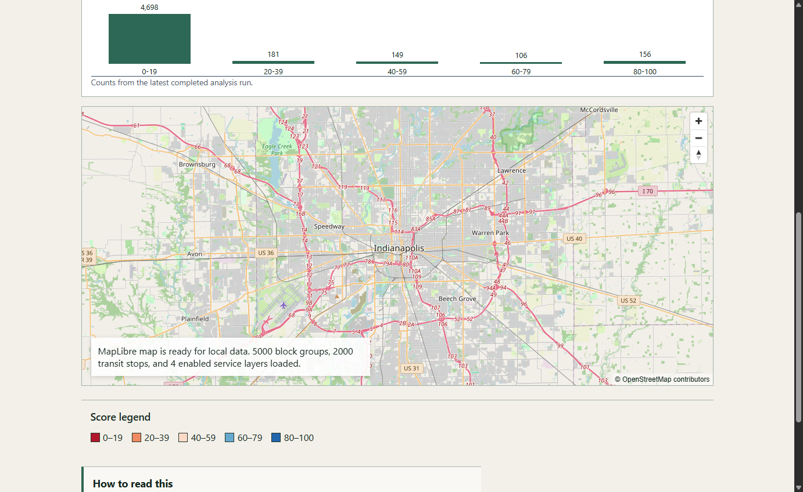
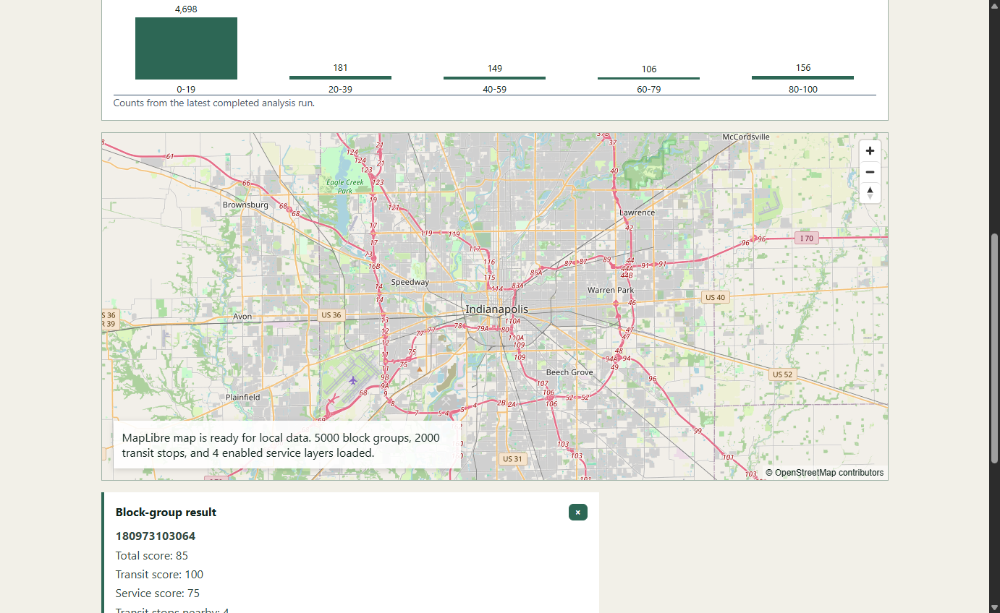
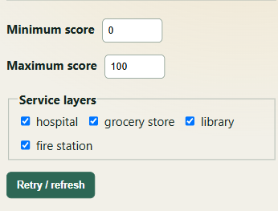
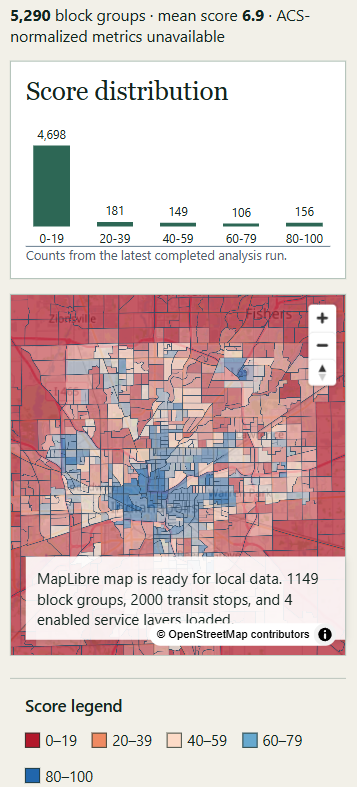
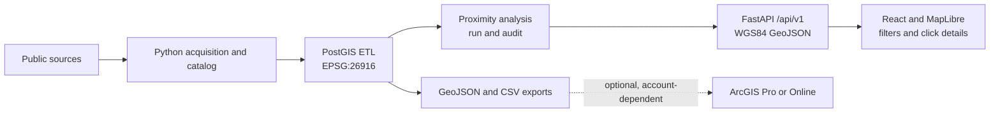

# Indy Geospatial Accessibility Platform

[](https://github.com/fetachino/indy-geospatial-accessibility-platform/actions/workflows/ci.yml)

A production-style GIS portfolio project investigating which Marion County,
Indiana neighborhoods have inadequate access to public transit and essential
services such as hospitals, grocery stores, schools, libraries, and fire
stations.

> **Current status:** v0.1.0 is released. The project is a free, locally
> runnable PostGIS, FastAPI, and React/MapLibre application with optional ArcGIS
> documentation. It is a planning-screening indicator, not a walking/network
> result, causal measure, or policy recommendation.

**Local demo:** start the services with the [quick-start commands](#quick-start),
then open the [interactive map](http://127.0.0.1:5173/) or the [FastAPI
documentation](http://127.0.0.1:8000/docs). These links are intentionally local;
the project does not claim a hosted deployment.

## Screenshots

### Map overview



County-wide Marion County exploration view with real score-colored block
groups, OpenStreetMap context, the latest score-distribution chart,
service-layer controls, and a readable score legend.

### Selected block-group detail



Click-driven inspection of one real block group, including its GEOID, total,
transit, and service scores, nearby transit count, service categories, and
status flags. The selected polygon is visibly highlighted.

### Mobile controls



Narrow-browser view demonstrating that score filters, service-layer toggles,
and the refresh control remain usable at mobile width.

### Mobile map overview



Narrow-browser map view showing the responsive score chart, basemap, colored
block groups, score legend, and local-data status message.

These are real local verification screenshots from the current PostGIS/API
run, not a hosted deployment claim.

The explorer now shows the latest API score buckets as a compact distribution
chart. Minimum/maximum score filters and a selected `geoid` are preserved in
the URL (`?min=0&max=100&geoid=...`), so a filtered or selected view can be
shared or restored on reload.

## What I built

This project turns public data into a reproducible spatial product:

- A cataloged acquisition layer with cached-source validation and provenance
- Projected-CRS ETL and transactional loading in PostGIS
- A transparent proximity score combining transit and essential-service access
- A tested FastAPI GeoJSON API with score filtering and feature details
- A responsive React/MapLibre interface with score charts, layer toggles, and
  click-driven block-group inspection

The methodology is deliberately transparent about uncertainty instead of
overstating what a proximity screen can prove.

## Key engineering highlights

- Reproducible public-data acquisition with source catalogs, validation, and
  cached raw files kept outside Git
- Transactional PostGIS ETL with projected-CRS transformations, spatial
  indexes, quarantine handling, lineage, and audit records
- Tested FastAPI endpoints serving filtered WGS84 GeoJSON and analysis-run
  summaries
- Responsive React/MapLibre interaction with score filters, layer toggles,
  URL-preserved selections, and click-driven feature details

## What this proves

- GIS data engineering with public-source provenance, validation, projected-CRS
  transformations, and spatial database loading
- Transparent accessibility analysis that separates proximity screening from
  walking access, network travel time, and policy conclusions
- Tested backend/API development with filtered GeoJSON, audit-aware analysis
  runs, and clear local diagnostics
- Responsive map-interface delivery with score visualization, layer controls,
  mobile layouts, and feature-level inspection

## Technology stack

**GIS and spatial data**

[](https://postgis.net/)
[](https://shapely.readthedocs.io/)
[](https://pyproj4.github.io/pyproj/)
[](https://github.com/GeospatialPython/pyshp)
[](https://maplibre.org/)
[](https://www.openstreetmap.org/)

**Backend and application development**

[](https://www.python.org/)
[](https://fastapi.tiangolo.com/)
[](https://www.postgresql.org/)
[](https://react.dev/)
[](https://www.typescriptlang.org/)

**Developer tools and delivery**

[](https://www.docker.com/products/docker-desktop/)
[](https://nodejs.org/)
[](https://vite.dev/)
[](https://docs.github.com/en/actions)

## Project question

> Which Marion County neighborhoods have inadequate access to public transit
> and essential services?

The delivered baseline exposes transparent accessibility indicators through a
documented API and interactive web map. It distinguishes straight-line
proximity from true network accessibility and documents uncertainty and
limitations.

## Architecture

- **Data and spatial processing:** Python, GeoPandas, Shapely, PyProj, and
  Rasterio where raster analysis is genuinely useful
- **Spatial storage:** PostgreSQL with PostGIS, run locally with Docker Compose
- **API:** FastAPI with a versioned HTTP interface
- **Web client:** React, TypeScript, and a provider-neutral mapping boundary
- **Web map:** MapLibre for the credential-free local baseline
- **Esri automation:** Optional ArcPy and ArcGIS Pro workflows kept separate
  from the open-source core
- **Quality:** Pytest, Ruff, mypy, Vitest, Testing Library, ESLint, Prettier,
  and GitHub Actions

The rationale and component boundaries are recorded in
[`docs/architecture/0001-platform-foundation.md`](docs/architecture/0001-platform-foundation.md).



## Repository layout

```text
backend/                 FastAPI application and Python tests
frontend/                React and TypeScript web client
database/                PostGIS migrations and database documentation
data/{raw,interim,processed}/  Local data products (contents ignored)
docs/                    ADRs, methodology, risk register, and future case study
scripts/                 Reproducible project and data commands
arcgis/                  Optional ArcGIS Pro and ArcPy workflows
.github/workflows/       Continuous integration
```

## Quick start

Prerequisites are Python 3.11+, Node.js 22+, and npm 10+.

### Backend

```bash
python -m venv .venv
# Windows PowerShell: .venv\Scripts\Activate.ps1
# macOS/Linux: source .venv/bin/activate
python -m pip install --upgrade pip
python -m pip install -e ".[dev]"
pytest
```

### Frontend

```bash
cd frontend
npm ci
npm run test
```

Copy `.env.example` to `.env` only when local overrides are needed. Never
commit secrets. The frontend reads the local API and renders score polygons,
transit stops, and service layers. Set `VITE_MAP_TILE_URL` to a public raster
tile template if a basemap is desired; the default blank basemap keeps local
development credential-free.

### Run the local demo

```powershell
docker compose -f database/docker-compose.yml up -d
python -m indy_accessibility_etl migrate
python -m indy_accessibility_etl production-db
python -m indy_accessibility_etl analyze
# Start FastAPI in this tab, then start the frontend in a second tab.
uvicorn indy_accessibility_api.main:app --reload
```

In a second PowerShell tab:

```powershell
cd frontend
npm ci
npm run dev
```

Open `http://127.0.0.1:5173/` for the map or
`http://127.0.0.1:8000/docs` for the API. The API uses the same `DATABASE_URL`
as ETL when set. Endpoint contracts, interaction details, and limitations are
in [`docs/api-web-map.md`](docs/api-web-map.md).

### Deeper technical workflows

The detailed data, ETL, and analysis workflows are documented separately:

- [`docs/data-provenance.md`](docs/data-provenance.md) — source decisions and
  limitations
- [`docs/schema-etl.md`](docs/schema-etl.md) — PostGIS schema, CRS, ETL,
  lineage, and validation
- [`docs/accessibility-methodology.md`](docs/accessibility-methodology.md) —
  thresholds, weights, score construction, and caveats


### Optional ArcGIS integration (Milestone 5)

The open-source PostGIS + FastAPI + React + MapLibre application remains the
default, free, locally runnable experience. [`docs/arcgis-integration.md`](docs/arcgis-integration.md)
provides ArcGIS Pro and ArcGIS Online runbooks, field aliases, CRS guidance,
safe sharing practices, and Dashboard/Experience Builder configuration ideas.
`arcgis/prepare_accessibility.py` is an optional ArcGIS Pro helper that exits
clearly when ArcPy is unavailable; no ArcGIS Pro execution or ArcGIS Online
publication is claimed. An ArcGIS Maps SDK provider remains a documented
future design requiring user-supplied Esri access.

## Data acquisition

List cataloged sources and their authority status:

```bash
python -m indy_accessibility_data catalog
python -m indy_accessibility_data catalog --verbose
```

Acquire one source, or all sources that do not require unavailable credentials:

```bash
python -m indy_accessibility_data acquire marion_county_boundary
python -m indy_accessibility_data acquire --all --skip-unavailable
```

To acquire ACS demographics, request a free key through the
[Census API key form](https://api.census.gov/data/key_signup.html), set it only
in the current shell, and run:

```bash
# PowerShell
$env:CENSUS_API_KEY="your-key"
python -m indy_accessibility_data acquire acs_2024_block_group_demographics

# bash/zsh
export CENSUS_API_KEY="your-key"
python -m indy_accessibility_data acquire acs_2024_block_group_demographics
```

Downloaded files are written to `data/raw/<dataset-id>/` with a sidecar JSON
manifest containing retrieval time, byte count, selected HTTP provenance, and a
SHA-256 checksum. Re-running a command validates and reuses a cached response.
Use `--force` to download again or `--validate-existing` after following a
catalog manual-download fallback. The entire raw cache is ignored by Git.

### Verified source inventory

| Analytical need | Selected source | Status and key limitation |
| --- | --- | --- |
| Study-area boundary | City of Indianapolis/Marion County boundary service | Official GeoJSON query; no explicit license in service metadata. |
| Small-area geography | Census 2024 TIGER/Line block groups | Official statewide archive; block groups are not resident-defined neighborhoods. |
| Transit stops, routes, and schedules | IndyGo static GTFS | Official feed validated; use remains subject to IndyGo's request form and terms. |
| Hospitals | IndianaMap Hospital Locations 2023 | State-published HIFLD-derived aggregator; incomplete sources and dataset age are explicit limitations. |
| Grocery stores | USDA SNAP Retailer Locator 2005–2025 | Federal fallback only; SNAP authorization is not a complete grocery inventory. |
| Schools | IDOE 2025–2026 School Directory | Official workbook; address-only records require later geocoding. |
| Libraries | Indiana State Library / IndianaMap 2025 locations | Official statewide point layer; later filtering must distinguish public libraries and cross-check current IndyPL branches. |
| Fire stations | City/County IFD station service | Official IFD points; non-IFD station coverage remains to be evaluated. |
| Population and demographics | Census 2020–2024 ACS 5-year API | Official block-group estimates with margins of error; API key required in the verified environment. |

Full field-level metadata, terms, manual fallbacks, formats, CRSs, and quality
rules are in [`data/catalog/datasets.json`](data/catalog/datasets.json). Source
selection rationale is in
[`docs/data-provenance.md`](docs/data-provenance.md).

## Verification

```bash
ruff check .
ruff format --check .
mypy backend/src
pytest

cd frontend
npm run lint
npm run format:check
npm run test
npm run build
```

Release artifacts and the technical narrative are in [`docs/case-study.md`](docs/case-study.md),
[`docs/resume-bullets.md`](docs/resume-bullets.md), and
[`docs/interview-talk-track.md`](docs/interview-talk-track.md). Draft v0.1.0
notes are in [`docs/release-notes-v0.1.0.md`](docs/release-notes-v0.1.0.md).

## Data policy

Authoritative public sources are preferred. Each dataset added in Milestone 1
must have a catalog entry recording its provider, direct URL, retrieval date,
license or terms, coverage, important fields, CRS, and limitations. Downloaded
and generated data are ignored by Git; reproducible acquisition scripts and
small legally redistributable test fixtures are committed instead. OpenStreetMap
will be used only when an authoritative source is unavailable or when its road
network is methodologically appropriate and attribution requirements are met.

## Delivered milestones

| Milestone | Delivered capability |
| --- | --- |
| **0 — Foundation** | Architecture, repository guidance, and installable backend/frontend foundations. |
| **1 — Data acquisition** | Cataloged sources, cached downloads, validation, legal fixtures, and manual fallbacks. |
| **2 — Spatial database and ETL** | PostGIS schema, projected-CRS transformations, production-source loading, lineage, and audit records. |
| **3 — Accessibility analysis** | Transparent proximity baseline, composite scoring, edge-case tests, and exports. |
| **4 — API and web map** | Versioned API and responsive MapLibre interface with filters, legends, and click details. |
| **5 — Esri integration** | Optional ArcGIS Pro/Online runbooks and graceful ArcPy fallback; no licensed execution claimed. |
| **6 — Portfolio release** | Verified setup, screenshots, case study, limitations, release notes, and recruiter-facing documentation. |

<!-- Historical milestone acceptance table retained below for project traceability; the concise delivered summary above is the reader-facing version.

| Milestone | Delivered capability |
| --- | --- |
| **0 — Foundation** | Architecture and risks documented; repository guidance and safe environment template present; installable FastAPI and React foundations; lint, type, test, and build checks pass in CI. No analytical claims. |
| **1 — Data acquisition** | Nine planned sources cataloged; cached downloads, SHA-256 manifests, format/schema validation, manual fallbacks, and legal fixtures implemented. ACS requires a user-provided key or manual download. |
| **2 — Spatial database and ETL** | PostGIS Compose service, cached-source production ETL, spatial schema/indexes, projected-CRS transformations, geometry repair, reproducible loads, lineage, and fixture/integration tests. School address geocoding and ACS acquisition remain explicit source limitations. |
| **3 — Accessibility analysis** | Transparent proximity baseline, population normalization, composite score, spatial edge-case tests, documented exports, and—if feasible—a separately described network comparison complete. |
| **4 — API and web map** | Versioned API and responsive interactive map expose real results with filters, legends, accessible controls, loading/error states, and backend/frontend tests. |
| **5 — Esri integration** | Optional ArcGIS Pro/Online runbooks, ArcGIS-ready metadata, and graceful ArcPy helper documented; no Esri account or licensed execution claimed. |
| **6 — Portfolio release** | Verified clean-environment commands, screenshots, architecture diagram, technical case study, findings and limitations, user guide, release notes, measured benchmarks if any, and evidence-based résumé bullets complete. |

-->

## Known limitations

- Data availability, licensing, schemas, and update frequency still require
  re-verification at each retrieval; several public services do not state an
  explicit open-data license.
- The application is documented for local Docker/PostGIS execution; no hosted
  deployment is claimed.
- No ArcGIS credentials or licenses are assumed. The open-source core must work
  without them.
- The selected grocery dataset measures SNAP-authorized retailers rather than a
  complete grocery-store universe.
- School locations require later geocoding, and facility inventories require
  later temporal and category filtering.
- ACS automation requires `CENSUS_API_KEY` in the current environment; the key
  is never stored in cache metadata.
- A circular proximity buffer is not a walking route. Any baseline using one
  will be labeled accordingly and kept distinct from network analysis.

See [`docs/risk-register.md`](docs/risk-register.md) for mitigations and
validation milestones.

## Contributing and license

See [`CONTRIBUTING.md`](CONTRIBUTING.md) for the development workflow. This
project is licensed under the [MIT License](LICENSE).
