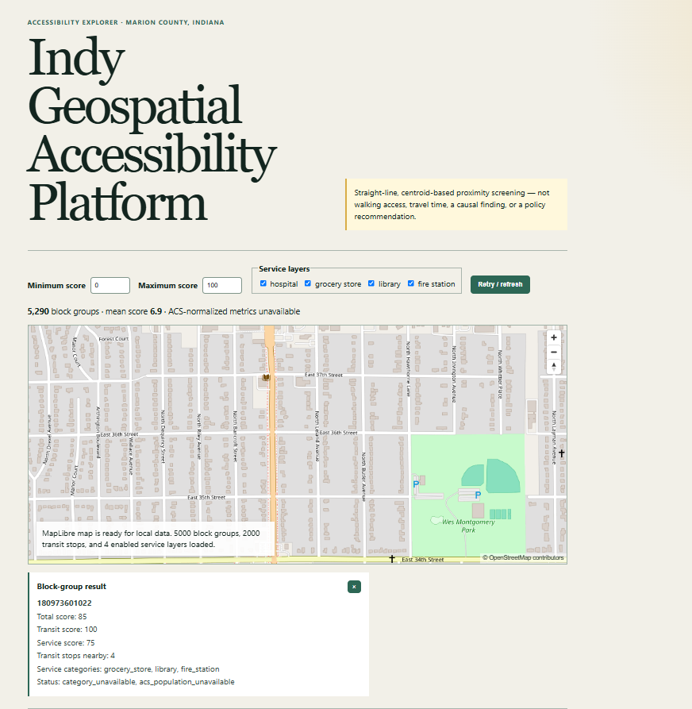

# Indy Geospatial Accessibility Platform

A production-style GIS portfolio project investigating which Marion County,
Indiana neighborhoods have inadequate access to public transit and essential
services such as hospitals, grocery stores, schools, libraries, and fire
stations.

> **Current status:** Milestone 4 adds a versioned FastAPI read API and a
> MapLibre interactive explorer backed by the local PostGIS analysis run. It
> remains a planning-screening indicator, not a walking/network result,
> causal measure, or policy recommendation.

## Project question

> Which Marion County neighborhoods have inadequate access to public transit
> and essential services?

The finished platform will calculate transparent, population-normalized
accessibility indicators and expose them through a documented API and an
interactive web map. It will distinguish straight-line proximity from true
network accessibility and document uncertainty and limitations.

## Planned architecture

- **Data and spatial processing:** Python, GeoPandas, Shapely, PyProj, and
  Rasterio where raster analysis is genuinely useful
- **Spatial storage:** PostgreSQL with PostGIS, run locally with Docker Compose
- **API:** FastAPI with a versioned HTTP interface
- **Web client:** React, TypeScript, and a provider-neutral mapping boundary
- **Web map:** MapLibre for the credential-free local baseline, with an ArcGIS
  Maps SDK adapter evaluated in Milestone 5
- **Esri automation:** Optional ArcPy and ArcGIS Pro workflows kept separate
  from the open-source core
- **Quality:** Pytest, Ruff, mypy, Vitest, Testing Library, ESLint, Prettier,
  and GitHub Actions

The rationale and component boundaries are recorded in
[`docs/architecture/0001-platform-foundation.md`](docs/architecture/0001-platform-foundation.md).

## Repository layout

```text
backend/                 FastAPI application and Python tests
frontend/                React and TypeScript web client
database/                PostGIS migrations and database documentation
data/{raw,interim,processed}/  Local data products (contents ignored)
docs/                    ADRs, methodology, risk register, and future case study
scripts/                 Reproducible project and data commands
arcgis/                  Optional ArcGIS Pro and ArcPy workflows
.github/workflows/       Continuous integration
```

## Quick start

Prerequisites are Python 3.11+, Node.js 22+, and npm 10+.

### Backend

```bash
python -m venv .venv
# Windows PowerShell: .venv\Scripts\Activate.ps1
# macOS/Linux: source .venv/bin/activate
python -m pip install --upgrade pip
python -m pip install -e ".[dev]"
pytest
uvicorn indy_accessibility_api.main:app --reload
```

The health check is available at `http://127.0.0.1:8000/health` and interactive
API documentation at `http://127.0.0.1:8000/docs`.

### Frontend

```bash
cd frontend
npm ci
npm run test
npm run dev
```

Copy `.env.example` to `.env` only when local overrides are needed. Never
commit secrets. The frontend reads the local API and renders score polygons,
transit stops, and service layers. Set `VITE_MAP_TILE_URL` to a public raster
tile template if a basemap is desired; the default blank basemap keeps local
development credential-free.

### API and web map (Milestone 4)

```bash
docker compose -f database/docker-compose.yml up -d
python -m indy_accessibility_etl migrate
python -m indy_accessibility_etl production-db
python -m indy_accessibility_etl analyze
uvicorn indy_accessibility_api.main:app --reload
cd frontend && npm ci && npm run dev
```

The API uses the same `DATABASE_URL` as ETL when set, or derives one from
`POSTGRES_HOST`, `POSTGRES_PORT`, `POSTGRES_DB`, `POSTGRES_USER`, and
`POSTGRES_PASSWORD`. It is documented at `/docs`; endpoint contracts and limitations are in
[`docs/api-web-map.md`](docs/api-web-map.md).
Click a rendered block-group polygon to inspect that feature's GEOID, score
components, nearby transit count, service categories, and status flags.

#### Verified browser result

Manual visual verification confirmed that single-clicking different block-group
polygons changes the selected GEOID and accessibility scores. The captured
result shows the interactive map, score controls, service toggles, legend, and
selected-feature detail card:



### PostGIS and ETL (Milestone 2)

Docker Desktop (or another Docker Engine) is required for a live database. Set
`POSTGRES_PASSWORD` in an untracked `.env`, then run:

```bash
docker compose -f database/docker-compose.yml up -d
python -m indy_accessibility_etl migrate
python -m indy_accessibility_etl load-fixture
python -m indy_accessibility_etl production-db
docker compose -f database/docker-compose.yml down
```

The fixture command is deterministic and exercises projection, duplicate
detection, and out-of-county quarantine without downloading production data.
`production-db` discovers the ignored Milestone 1 cache, validates and projects
the cached boundary, Census block groups, IndyGo stops, hospitals, SNAP
retailers, libraries, and IFD stations, then loads supported records
transactionally with provenance and audit rows. It reports the school workbook
as address-only (geocoding is deferred) and reports ACS as unavailable when no
cached API response exists.
For a fresh database, `docker compose -f database/docker-compose.yml down -v`
removes the named volume (irreversible). Set `POSTGIS_TEST_DATABASE_URL` to run
optional integration tests; otherwise tests clearly skip that environment-only
check. See [`docs/schema-etl.md`](docs/schema-etl.md) for schema, lineage, CRS,
and validation details.

### Accessibility analysis (Milestone 3)

After the PostGIS database is loaded, run the configurable proximity baseline
and export a run by ID:

```bash
python -m indy_accessibility_etl analyze
python -m indy_accessibility_etl export <run-id>
```

Outputs are written to ignored `data/processed/` files. The exact 400-meter
transit threshold, 1,600-meter service threshold, weights, missing-category
handling, and ACS behavior are documented in
[`docs/accessibility-methodology.md`](docs/accessibility-methodology.md).

### Optional ArcGIS integration (Milestone 5)

The open-source PostGIS + FastAPI + React + MapLibre application remains the
default, free, locally runnable experience. [`docs/arcgis-integration.md`](docs/arcgis-integration.md)
provides ArcGIS Pro and ArcGIS Online runbooks, field aliases, CRS guidance,
safe sharing practices, and Dashboard/Experience Builder configuration ideas.
`arcgis/prepare_accessibility.py` is an optional ArcGIS Pro helper that exits
clearly when ArcPy is unavailable; no ArcGIS Pro execution or ArcGIS Online
publication is claimed. An ArcGIS Maps SDK provider remains a documented
future design requiring user-supplied Esri access.

## Data acquisition

List cataloged sources and their authority status:

```bash
python -m indy_accessibility_data catalog
python -m indy_accessibility_data catalog --verbose
```

Acquire one source, or all sources that do not require unavailable credentials:

```bash
python -m indy_accessibility_data acquire marion_county_boundary
python -m indy_accessibility_data acquire --all --skip-unavailable
```

To acquire ACS demographics, request a free key through the
[Census API key form](https://api.census.gov/data/key_signup.html), set it only
in the current shell, and run:

```bash
# PowerShell
$env:CENSUS_API_KEY="your-key"
python -m indy_accessibility_data acquire acs_2024_block_group_demographics

# bash/zsh
export CENSUS_API_KEY="your-key"
python -m indy_accessibility_data acquire acs_2024_block_group_demographics
```

Downloaded files are written to `data/raw/<dataset-id>/` with a sidecar JSON
manifest containing retrieval time, byte count, selected HTTP provenance, and a
SHA-256 checksum. Re-running a command validates and reuses a cached response.
Use `--force` to download again or `--validate-existing` after following a
catalog manual-download fallback. The entire raw cache is ignored by Git.

### Verified source inventory

| Analytical need | Selected source | Status and key limitation |
| --- | --- | --- |
| Study-area boundary | City of Indianapolis/Marion County boundary service | Official GeoJSON query; no explicit license in service metadata. |
| Small-area geography | Census 2024 TIGER/Line block groups | Official statewide archive; block groups are not resident-defined neighborhoods. |
| Transit stops, routes, and schedules | IndyGo static GTFS | Official feed validated; use remains subject to IndyGo's request form and terms. |
| Hospitals | IndianaMap Hospital Locations 2023 | State-published HIFLD-derived aggregator; incomplete sources and dataset age are explicit limitations. |
| Grocery stores | USDA SNAP Retailer Locator 2005–2025 | Federal fallback only; SNAP authorization is not a complete grocery inventory. |
| Schools | IDOE 2025–2026 School Directory | Official workbook; address-only records require later geocoding. |
| Libraries | Indiana State Library / IndianaMap 2025 locations | Official statewide point layer; later filtering must distinguish public libraries and cross-check current IndyPL branches. |
| Fire stations | City/County IFD station service | Official IFD points; non-IFD station coverage remains to be evaluated. |
| Population and demographics | Census 2020–2024 ACS 5-year API | Official block-group estimates with margins of error; API key required in the verified environment. |

Full field-level metadata, terms, manual fallbacks, formats, CRSs, and quality
rules are in [`data/catalog/datasets.json`](data/catalog/datasets.json). Source
selection rationale is in
[`docs/data-provenance.md`](docs/data-provenance.md).

## Verification

```bash
ruff check .
ruff format --check .
mypy backend/src
pytest

cd frontend
npm run lint
npm run format:check
npm run test
npm run build
```

## Data policy

Authoritative public sources are preferred. Each dataset added in Milestone 1
must have a catalog entry recording its provider, direct URL, retrieval date,
license or terms, coverage, important fields, CRS, and limitations. Downloaded
and generated data are ignored by Git; reproducible acquisition scripts and
small legally redistributable test fixtures are committed instead. OpenStreetMap
will be used only when an authoritative source is unavailable or when its road
network is methodologically appropriate and attribution requirements are met.

## Roadmap and acceptance criteria

| Milestone | Acceptance boundary |
| --- | --- |
| **0 — Foundation** | Architecture and risks documented; repository guidance and safe environment template present; installable FastAPI and React foundations; lint, type, test, and build checks pass in CI. No analytical claims. |
| **1 — Data acquisition (current)** | Nine planned sources cataloged; cached downloads, SHA-256 manifests, format/schema validation, manual fallbacks, and synthetic legal fixtures implemented. Eight credential-free sources verified live; ACS requires a user-provided key or manual download. |
| **2 — Spatial database and ETL (in progress)** | PostGIS Compose service, cached-source production ETL for supported Milestone 1 files, spatial schema/indexes, projected-CRS transformations, geometry repair, reproducible loads, lineage, and fixture/integration tests. School address geocoding and ACS acquisition remain explicit source limitations. |
| **3 — Accessibility analysis** | Transparent proximity baseline, population normalization, composite score, spatial edge-case tests, documented exports, and—if feasible—a separately described network comparison complete. |
| **4 — API and web map** | Versioned API and responsive interactive map expose real results with filters, legends, accessible controls, loading/error states, and backend/frontend tests. |
| **5 — Esri integration** | Optional ArcGIS Pro/Online runbooks, ArcGIS-ready metadata, and graceful ArcPy helper documented; no Esri account or licensed execution claimed. |
| **6 — Portfolio release** | Verified clean-environment commands, screenshots, architecture diagram, technical case study, findings and limitations, user guide, release notes, measured benchmarks if any, and evidence-based résumé bullets complete. |

## Known limitations

- Data availability, licensing, schemas, and update frequency still require
  re-verification at each retrieval; several public services do not state an
  explicit open-data license.
- Docker is installed in the initial development environment, but the Docker
  engine was not responsive during the first inspection; PostGIS support will
  be validated in Milestone 2.
- No local `psql` client was detected during the first inspection.
- No ArcGIS credentials or licenses are assumed. The open-source core must work
  without them.
- The selected grocery dataset measures SNAP-authorized retailers rather than a
  complete grocery-store universe.
- School locations require later geocoding, and facility inventories require
  later temporal and category filtering.
- ACS automation requires `CENSUS_API_KEY` in the current environment; the key
  is never stored in cache metadata.
- A circular proximity buffer is not a walking route. Any baseline using one
  will be labeled accordingly and kept distinct from network analysis.

See [`docs/risk-register.md`](docs/risk-register.md) for mitigations and
validation milestones.

## Contributing and license

See [`CONTRIBUTING.md`](CONTRIBUTING.md) for the development workflow. This
project is licensed under the [MIT License](LICENSE).
