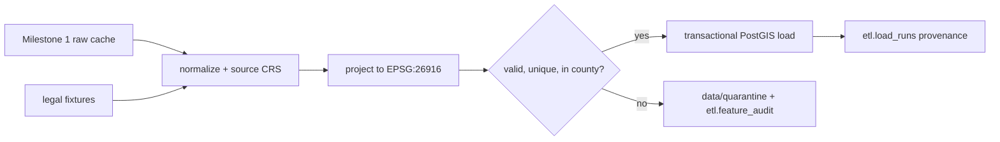

# Milestone 2: PostGIS schema and ETL

The database is a local PostgreSQL/PostGIS service. The ETL boundary reads the
Milestone 1 cache (or the committed legal fixtures), normalizes source IDs and
attributes, transforms coordinates to EPSG:26916, validates geometry, then
writes one transactional load run. Re-running a load uses stable source IDs
and is safe to repeat. Raw, interim, processed, and quarantine directories are
ignored by Git.

## Schema and lineage

`boundaries` stores the study boundary, `demographics` stores Census block
group geometry and later ACS attributes, and `transit` stores stops and route
metadata. Service points are stored in `services.service_locations` with a
constrained service type; views expose the required hospital, grocery, school,
library, and fire-station collections. Every feature carries its source ID,
source CRS, retrieval date, and load-run ID. GiST indexes support future
spatial joins.

EPSG:26916 (NAD83 / UTM zone 16N) is a meter-based projected CRS appropriate to
Marion County. Transformations use explicit source CRS metadata and preserve
that value after loading. Invalid geometries receive only a conservative
`buffer(0)` repair when it produces a valid, non-empty result. Duplicates,
empty/unrepairable geometries, and features outside the county are quarantined
with a reason; no record is silently dropped.

## Commands and limitations

See [`database/README.md`](../database/README.md) for Compose setup, migration,
fixture, shutdown, and reset commands. `load-fixture` exercises the ETL rules
without production downloads or credentials. A real PostGIS integration test
requires `POSTGIS_TEST_DATABASE_URL`; it is skipped when that variable is not
set. During this milestone's development environment the Docker CLI was
installed but the Docker Desktop engine was unavailable, so no claim is made
that a live database load completed. Accessibility indicators, network travel
times, and the interactive map remain Milestone 3+ work.
